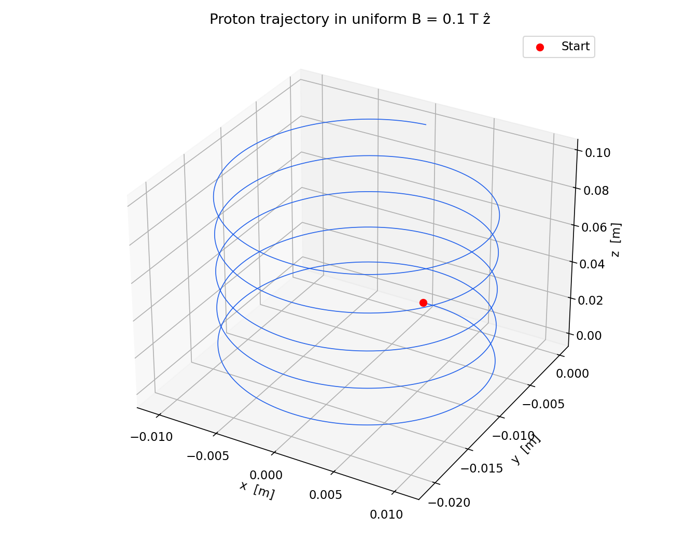
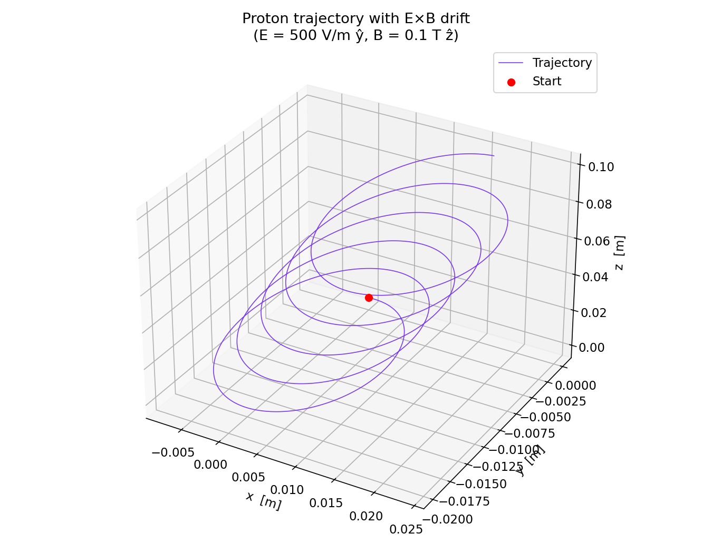
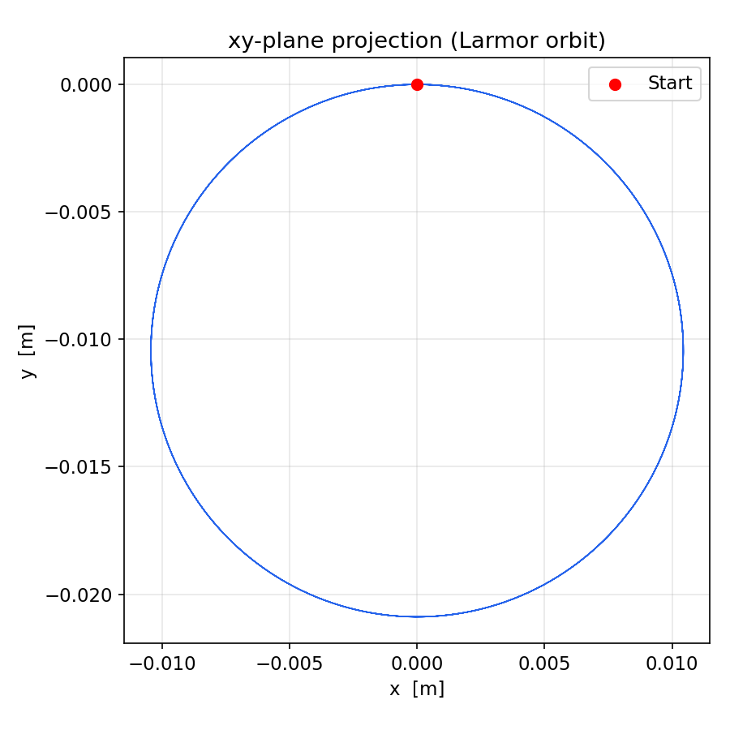
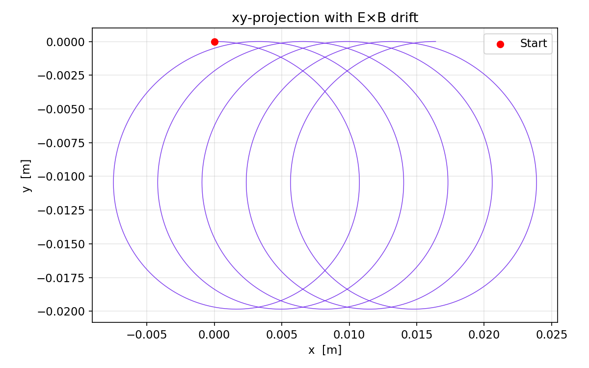
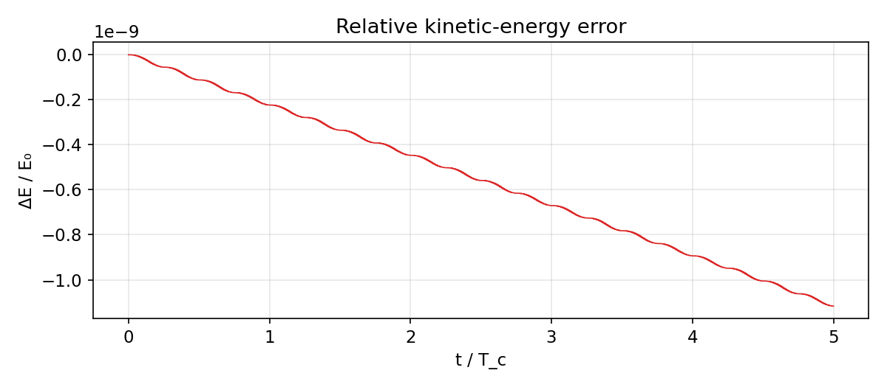

# Charged Particle Dynamics in Electromagnetic Fields

<p align="center">
  
  
</p>

Numerical simulation of a charged particle (proton) moving in static electromagnetic fields, solved with the **4th-order Runge–Kutta** method via SciPy.

## Physics

A particle with charge $q$ and mass $m$ in fields $\mathbf{E}$ and $\mathbf{B}$ obeys the Lorentz equation:

$$m \frac{d\mathbf{v}}{dt} = q\left(\mathbf{E} + \mathbf{v}\times\mathbf{B}\right)$$

Two scenarios are simulated:

| Scenario | Fields | Trajectory | Key physics |
|----------|--------|-----------|-------------|
| **Pure B** | $B = 0.1\;\text{T}\;\hat{z}$ | Helix | Cyclotron gyration + free streaming along $\hat{z}$ |
| **E ⊥ B** | $E = 500\;\text{V/m}\;\hat{y}$, same B | Drifting helix | $\mathbf{E}\times\mathbf{B}$ drift in $\hat{x}$ direction |

### Characteristic scales (proton, $B = 0.1$ T)

| Quantity | Symbol | Value |
|----------|--------|-------|
| Cyclotron frequency | $\omega_c$ | $9.58 \times 10^6\;\text{rad/s}$ |
| Cyclotron period | $T_c$ | $6.56 \times 10^{-7}\;\text{s}$ |
| Larmor radius | $r_L$ | $1.04 \times 10^{-2}\;\text{m}$ |

## Results

<p align="center">
  
  
</p>

<p align="center">
  
</p>

The RK45 integrator conserves kinetic energy to $\sim 10^{-9}$ relative error over 5 cyclotron periods, confirming numerical accuracy.

## Repository Structure

```
├── simulation.ipynb   # Jupyter notebook with full derivation, code, and plots
├── particle.py        # Standalone simulation script
├── requirements.txt   # Python dependencies
├── README.md
└── *.png              # Generated figures
```

## Quick Start

```bash
git clone https://github.com/Danyil-Dorosh/charged-particle-sim.git
cd charged-particle-sim
pip install -r requirements.txt
jupyter notebook simulation.ipynb
```

Or run the standalone script:

```bash
python particle.py
```

## Dependencies

- Python ≥ 3.8
- NumPy
- SciPy
- Matplotlib
- Jupyter

## Author

**Danyil Dorosh** — Physics student, University of Warsaw

## License

MIT
